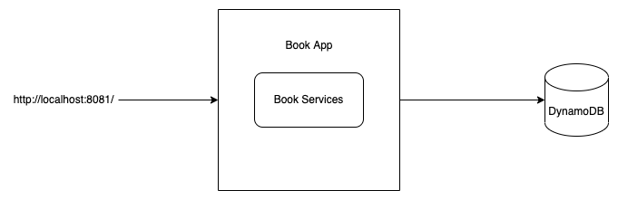
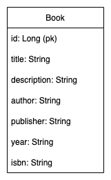

# DynamoDB REST APIs example

>  https://docs.aws.amazon.com/amazondynamodb/latest/developerguide/DynamoDBLocal.DownloadingAndRunning.html
  
### Run DynamoDB

>  java -Djava.library.path=./DynamoDBLocal_lib -jar DynamoDBLocal.jar -sharedDb

### Show Tables

>  aws dynamodb list-tables --endpoint-url http://localhost:8000

### Create Table

>  aws dynamodb create-table --attribute-definitions AttributeName=id,AttributeType=S --table-name Book --key-schema AttributeName=id,KeyType=HASH --provisioned-throughput ReadCapacityUnits=1,WriteCapacityUnits=1 --region us-east-1 --output json --endpoint-url http://localhost:8000

### Delete Table

>  aws dynamodb delete-table --table-name Book --endpoint-url http://localhost:8000

## Architecture

## ER Diagram

### References
* https://aws.amazon.com/dynamodb/
* https://docs.aws.amazon.com/amazondynamodb/latest/developerguide/DynamoDBLocal.DownloadingAndRunning.html
* https://awsclibuilder.com/home/services/dynamodb

### Other Repos

* https://github.com/Deloitte/DynamoDB-REST-APIs-Example.git
* https://github.com/Deloitte/Blog-App-Monolith.git
* https://github.com/Deloitte/Blog-App-Microservices.git
* https://github.com/Deloitte/Blog-App-Microservices-API-Gateway.git
* https://github.com/Deloitte/Blog-App-Microservices-Unit-Integration-Testing.git